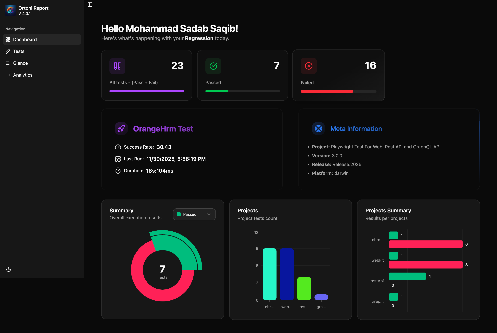

# Playwright TypeScript Test Automation Framework

## Requirements:

[](https://nodejs.org/en/download/)
[](https://code.visualstudio.com/download)

## Getting Started:

Clone Repository

```bash
git clone https://github.com/sadabnepal/playwright-test-ui-api.git
cd playwright-test-ui
```

Install Packages
```bash
npm install
npm run prepare
```

Install Browsers
```bash
npx playwright install --with-deps chromium
npx playwright install --with-deps webkit
```

Run tests and Generate Report

```bash
npm test                 [ run all tests ]
npm run test:chromium    [ Run UI tests in Chromium ]
npm run test:webkit      [ Run UI tests in Webkit ]
npm run test:api:rest    [ Run API tests ]
npm run test:api:graphql [ Run API tests ]
```

Code Analyze and Fix
```bash
npm run lint
npm run lint:fix
```

check script section of package.json for more test commands

### Features:
    - Support for: Web App, Rest API, GraphQL
    - Report: Playwright HTML, Ortoni HTML
    - CI/CD: Github Action
    - Schema validation: zod library
    - Test data generator: faker-js library
    - Multi environment and secretes: dotenv library
    - Code Quality Control: EsLint, Husky, Custom Interface

### Tech stacks:
[](https://playwright.dev/)
[](https://graphql.org/learn/)
[](https://www.typescriptlang.org/)
[](https://github.com/features/actions)
[]([https://www.docker.com/](https://typescript-eslint.io/))
[]([https://www.docker.com/](https://typicode.github.io/husky/))
[](https://zod.dev/)


## Sample Report:

