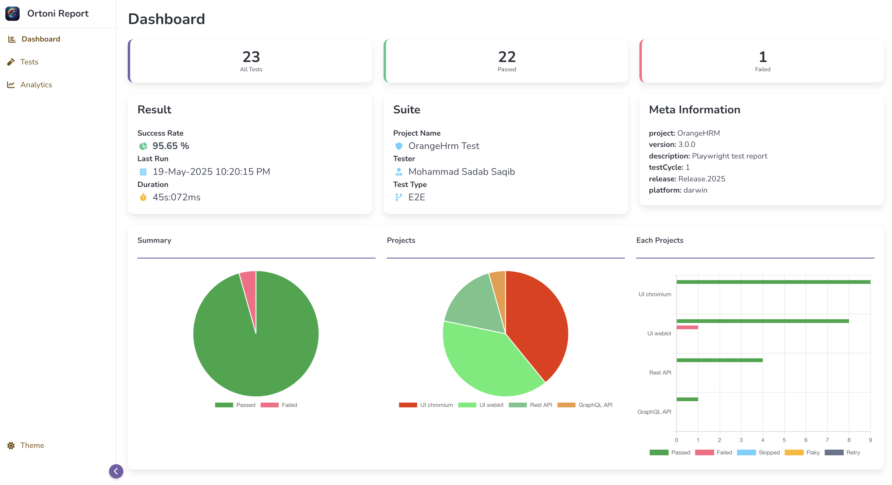

# Playwright TypeScript Test Automation Framework

## Requirements:

[](https://nodejs.org/en/download/)
[](https://code.visualstudio.com/download)

## Getting Started:

Clone Repository

```bash
git clone https://github.com/sadabnepal/playwright-test-ui-api.git
cd playwright-test-ui
```

Install Packages
```bash
npm install
npm run prepare
```

Install Browsers
```bash
npx playwright install --with-deps --chromium
npx playwright install --with-deps --webkit
```

Run tests and Generate Report

```bash
npm test            [ run all tests ]
npm run test:chrome [ Run UI tests in Chromium ]
npm run test:webkit [ Run UI tests in Webkit ]
npm run test:api    [ Run API tests ]
```

Code Analyze and Fix
```bash
npm run lint
npm run lint:fix
```

check script section of package.json for more test commands


TODO:
- update readme file

## Sample Report:

